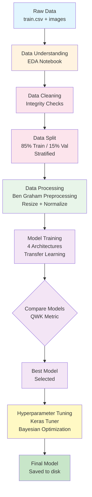
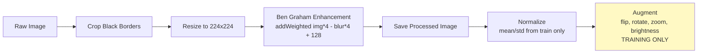

# APTOS 2019 Blindness Detection — Deep Learning Pipeline

## Project Overview

This project builds a deep learning image classification system to detect **Diabetic Retinopathy (DR)** severity from retinal fundus photographs using the APTOS 2019 dataset : https://www.kaggle.com/competitions/aptos2019-blindness-detection/data.

**Classification Task:** Classify retinal images into 5 severity levels:
| Class | Severity | Description |
|-------|----------|-------------|
| 0 | No DR | Healthy retina |
| 1 | Mild | Few microaneurysms |
| 2 | Moderate | More than just microaneurysms |
| 3 | Severe | Extensive intraretinal abnormalities |
| 4 | Proliferative DR | Neovascularization present |

**Dataset:** 3,662 training images | 1,928 test images

---

## Pipeline Workflow



---

## Project Structure

```
dataScience_workflow/
├── README.md
├── data/
│   ├── raw/
│   │   ├── train.csv
│   │   ├── test.csv
│   │   ├── train_images/          (3,662 .png files)
│   │   └── test_images/           (1,928 .png files)
│   └── processed/
│       ├── train_split.csv        (training split metadata)
│       ├── val_split.csv          (validation split metadata)
│       ├── normalization_stats.csv (channel mean/std from train only)
│       ├── class_weights.csv      (balanced class weights)
│       ├── train_images/          (preprocessed training images)
│       ├── val_images/            (preprocessed validation images)
│       └── test_images/           (preprocessed test images)
├── notebooks/
│   ├── EDA/
│   │   └── Eda_fyp.ipynb                        [Step 1]
│   ├── Preprocessing/
│   │   ├── 02_Data_Cleaning_and_Split.ipynb      [Step 2-3]
│   │   └── 03_Data_Processing.ipynb              [Step 4]
│   └── model_training/
│       ├── 01_Model_Training_Baseline.ipynb      [Step 5 - Task 1]
│       └── 02_Model_Tuning.ipynb                 [Step 6 - Task 2]
├── models/
│   └── final_efficientnetb3_tuned.h5             (saved final model)
└── tuner_results/                                (Keras Tuner logs)
```

---

## Execution Order

| Step | Notebook | Purpose |
|------|----------|---------|
| 1 | `EDA/Eda_fyp.ipynb` | Data understanding — class distribution, image properties, visualization |
| 2 | `Preprocessing/02_Data_Cleaning_and_Split.ipynb` | Data cleaning + stratified train/val split |
| 3 | `Preprocessing/03_Data_Processing.ipynb` | Ben Graham preprocessing, normalization stats, augmentation pipeline |
| 4 | `model_training/01_Model_Training_Baseline.ipynb` | Train & compare 4 models (Task 1) |
| 5 | `model_training/02_Model_Tuning.ipynb` | Hyperparameter tuning with Keras Tuner (Task 2) |

---

## Models Used

| Model | Type | Key Strength | Params |
|-------|------|-------------|--------|
| ResNet50 | Residual Network | Skip connections prevent vanishing gradients | ~25.6M |
| EfficientNetB3 | Compound Scaling | Best accuracy-to-compute ratio | ~12.2M |
| DenseNet121 | Dense Connections | Feature reuse — ideal for small datasets | ~8.0M |
| InceptionV3 | Multi-scale CNN | Captures features at multiple resolutions | ~23.8M |

---

## Preprocessing Pipeline



---

## Data Leakage Prevention

| Measure | Implementation |
|---------|---------------|
| Split before processing | Raw data split → then preprocessing applied |
| Zero overlap verified | Programmatic check confirms no shared IDs |
| Normalization from train only | Channel mean/std computed exclusively on training split |
| Augmentation train only | Validation/test see original images (no augmentation) |
| Class weights from train only | Balanced weights derived from training labels |
| Test set never used | No labels available; only for final predictions |

---

## Hyperparameters Tuned (Task 2)

| Parameter | Search Range | Method |
|-----------|-------------|--------|
| Learning Rate | 1e-5, 1e-4, 5e-4, 1e-3 | Keras Tuner (Bayesian) |
| Dropout Rate | 0.2, 0.3, 0.4, 0.5 | Keras Tuner (Bayesian) |
| Dense Units | 256, 512, 1024 | Keras Tuner (Bayesian) |
| Unfreeze Layers | 0, 20, 50 | Keras Tuner (Bayesian) |
| Optimizer | Adam, SGD+momentum | Keras Tuner (Bayesian) |

**Total search space:** 288 combinations | **Trials:** 15 (Bayesian optimization)

---

## Evaluation Metrics

- **Quadratic Weighted Kappa (QWK)** — Primary metric (accounts for ordinal nature of DR grading)
- **Accuracy** — Overall correctness
- **Classification Report** — Per-class precision, recall, F1-score
- **Confusion Matrix** — Error pattern analysis

---

## Requirements

- Python 3.10+
- TensorFlow 2.x
- keras-tuner
- OpenCV (cv2)
- scikit-learn
- pandas, numpy, matplotlib, seaborn

---

## Author

Owen T. — ODL Official Assignment
